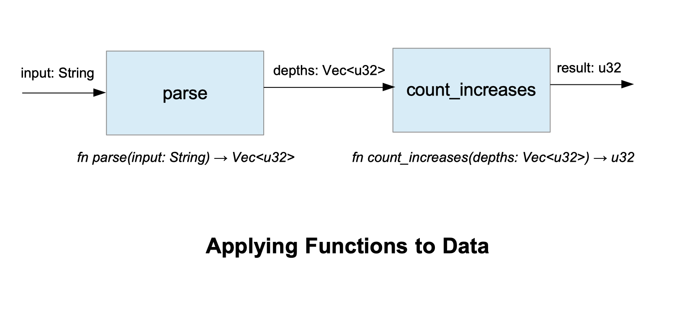

Learning through Problem Solving

[_I've been thinking about where to take this book. And mulling over the relative merits of [picking Rust instead of Go](https://blog.logrocket.com/when-to-use-rust-and-when-to-use-golang/). Guidance seems to be: pick Rust if you need performance, and Go if readability and simplicity are a priority. Usually I do prefer those. So I was thinking about learning through problem solving, and I came back to Advent of Code. I wondered if I could write a Rust programme to solve the AOC puzzles. So here goes. And it's going to be mostly code, because I want to make this as dyslexia-friendly as possible. It probably needs more diagrams._]

Here's [Day 1](https://adventofcode.com/2021/day/1).

If you want to follow along and complete the problems yourself, you'll need to sign in with a Github/Google/Twitter or Reddit account.

`mkdir day1`

`cd day1`

We use `cargo` to set up the project structure and run code.

(To run these examples you'll need to install the Rust tools, by following the [installation instructions](https://doc.rust-lang.org/cargo/getting-started/installation.html).)

`cargo init`

Here's what the directory should look like:

```
.
├── Cargo.toml
└── src
    └── main.rs
```

The problem description gives us an example scenario, which we can use to take _Test-Driven Development_ flow. Add this code to `main.rs`.

We can think of the solution as applying functions to data, first _parsing_ the input text into a type that our _domain logic_ can use more easily.

Here is what that flow looks like:



```
fn count_increases(_depths: Vec<u32>) -> u32 {
    0     // Deliberately return wrong result so test fais
}

#[cfg(test)]
mod tests {
    use super::*;

    fn test_data() -> Vec<u32> {
        vec![199, 200, 208, 210, 200, 207, 240, 269, 260, 263]
    }

    #[test]
    fn it_counts_increases() {
        let depths = test_data();
        assert_eq!(7, count_increases(depths));
    }
}
```

Start with a failing test:

`cargo test`

```
running 1 test
test tests::it_counts_increases ... FAILED

failures:

---- tests::it_counts_increases stdout ----
thread 'tests::it_counts_increases' panicked at 'assertion failed: `(left == right)`
  left: `7`,
 right: `0`', src/main.rs:20:9
note: run with `RUST_BACKTRACE=1` environment variable to display a backtrace


failures:
    tests::it_counts_increases

```

Now fix the test.

```
fn count_increases(depths: Vec<u32>) -> u32 {
    let mut increases = 0u32;
    let mut current = depths[0];   // Start with initial depth
    for depth in &depths[1..] {    // Loop through other values
        if *depth > current {
            increases = increases+1;
        }
        current = *depth;
    }
    increases
}
```

`cargo test`

```
running 1 test
test tests::it_counts_increases ... ok

test result: ok. 1 passed; 0 failed; 0 ignored; 0 measured; 0 filtered out; finished in 0.00s
```

There's too much input data to paste into the code. So let's keep it in a file, read that file and parse it into the types that we need.

What does the [input data](https://adventofcode.com/2021/day/1/input) look like?

```
176
184
196
199
204
... followed by 195 more lines
```

Add a test for parsing.

```
#[test]
fn it_parses_input() {
    let input = String::from("123\n456\n789\n1234");
    assert_eq!(vec![123, 456, 789, 1234], parse(input));
}
```    

and an initial implementation function that takes a string and returns a vector of 32-bit unsigned integers. Start by making the test fail, with an empty vectior.

```
fn parse(input: String) -> Vec<u32> {
    Vec::new()
}
```

`cargo test`

```
---- tests::it_parses_input stdout ----
thread 'tests::it_parses_input' panicked at 'assertion failed: `(left == right)`
  left: `[123, 456, 789, 1234]`,
 right: `[]`', src/main.rs:38:9
note: run with `RUST_BACKTRACE=1` environment variable to display a backtrace


failures:
    tests::it_parses_input
```    

Good.

Now let's fix it.

```
fn parse(input: String) -> Vec<u32> {
    input.split("\n")               // Split by newline
        .map(|x| x.parse::<u32>()   // Parse each element into an integer
            .unwrap())
        .collect::<Vec<_>>()        // Re-assemble as a vector
}
```

Now we can bring the pieces together in the `main` function. Save the problem input into day1.txt, in the project root.

```
$ tree -I target
.
├── Cargo.lock
├── Cargo.toml
├── day1.txt
└── src
    └── main.rs
```

My input contains 2000 entries.

```
$ wc -l day1.txt
    2000 day1.txt
$
```

The main function ...

```
use std::fs;
    
fn main() {
    let input = fs::read_to_string("day1.txt")
        .expect("failed to read day1 input");
    let depths = parse(input);
    println!("Day 1 Part 1 {}", count_increases(depths));
}
```

`cargo run`

```
$ cargo run
. . .
     Running `target/debug/day1`
thread 'main' panicked at 'called `Result::unwrap()` on an `Err` value: ParseIntError { kind: Empty }', src/main.rs:25:14
note: run with `RUST_BACKTRACE=1` environment variable to display a backtrace
$
```

Hmm. :thinking:

`od -c day1.txt`

```
. . .
0022520    5   5   5   1  \n   5   5   6   9  \n   5   5   7   0  \n   5
0022540    5   8   4  \n   5   5   8   8  \n   5   5   9   6  \n
```

There is a trailing newline, which means we have a value at the end that we can't parse.

Update `parse` to remove the trailing newline with `trim_end()`:

```
fn parse(input: String) -> Vec<u32> {
    input.trim_end().split("\n")           // Split by newline
        .map(|x| x.parse::<u32>()   // Parse each element into an integer
            .unwrap())
        .collect::<Vec<_>>()        // Re-assemble as a vector
}
```

`cargo run`

`Day 1 Part 1 nnnn`

My result gives `1342`. You may get a different result as the inputs can be different for different people.

That's part 1 done! Once we've solved it the Advent of Code site reveals part 2 ...

